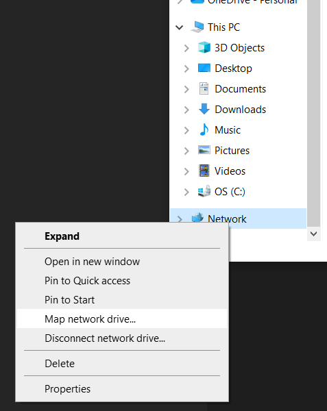

[Home](Home)

# Lab Network Drive (Group Drive)

The lab has a network drive to store files generated from research conducted by the lab. This drive is backed up at regular intervals and it is believed to have an effectively infinite amount of storage.

**Contents**

[TOC]

---
## Obtaining Access

Accessing the group drive involves two steps:

1. Obtain access permissions for your CADE account. This is done by the department IT staff and must be authorized by Jake. Jake usually takes care of this step for you as part of [onboarding](Onboarding.md). If you need this, request it from Jake.
2. Mount/Map the group drive to your computer so it can be accessed as if it were a local drive installed inside your computer.

---
## Mounting/Mapping the Group Drive

Mounting the group drive allows you to access the drive as if it were a local drive on your system. Mounting is done on your computer on a per user basis. In other words, every user on a system will need to mount the drive themselves. The reason for this is that your personal CADE account information is used to access the drive. Below are instructions for mounting/mapping the drive on Windows and Linux.

>**IMPORTANT:** Your computer must be connected to the University of Utah network in order to access the group drive. It cannot be accessed remotely over the internet without using University of Utah remote access.

### Windows

To map the group drive on Windows, follow these steps:

1. Open the File Explorer.
2. Right click on `This PC` or `Network` in the file tree on the left side of the window and select the *Map Network Drive...* context menu option.
    
    
    
3. Select a drive letter that isn't already in use to assign to the group drive. Using `Z:` is recommended if it is available but you may chose any available letter.
4. Put the group drive URL `\\chips.eng.utah.edu\telerobotics` into the Folder box and make sure *Reconnect at sign-in* is checked.
5. Click *Finish*.
6. You will be asked for your CADE username and password. Your username must be prepended with `USERS\`. For example, for a username of `johndoe` you would type `USERS\johndoe` in the username box.
7. Make sure *Remember my credentials* is checked if you don't want to enter your password every time you login.
7. Click *OK*.

### Linux

>**NOTE:** Root privileges will be needed.

These instructions are adapted from [this Ubuntu Wiki page][1] and [this serverfault StackExchange question][2] to give specific instructions for our lab.

You will be using `cifs` (Common Internet File System) to mount the drive by adding a line to the `/etc/fstab` file on your system (`fstab` stands for file systems table). Therefore you must first install `cifs` if it is not already installed:

    sudo apt install cifs-utils

The following conventions are assumed for the rest of these instructions:

- `linuxusername` is your username on your Linux system
- `cadeusername` is your CADE username
- `cadepassword` is your CADE password

Next we need to create the directory where the drive will be mounted. It is recommended that you use a directory named `telerobotics-group` in your home directory. This directory is assumed as the mounting directory throughout the rest of these instructions.

    mkdir ~/telerobotics-group

The line we are going to add to `/etc/fstab` must have a reference to your CADE login information. However, the `/etc/fstab` file can be read by anyone on the system so we want to avoid putting your password in plain text into the `/etc/fstab` file. This is done by creating a file named `.smbcredentials` in your home directory that contains the CADE login info. We then make the line in `/etc/fstab` reference that file.

Create the `.smbcredentials` file:

    gedit ~/.smbcredentials

This will open the `gedit` text editor and set it up such that saving will create a `.smbcredentials` file in your home directory.

Add your CADE login info to the file by adding the following lines (with your personal CADE info of course):

    username=cadeusername
    password=cadepassword

The syntax of the `.smbcredentials` file is very important. Make sure you only have those two lines and no white space anywhere (except perhaps if you have a space in your password).

Save and close the `.smbcredentials` file. We now want to set the permissions of this file so it cannot be read by other users on the system.

    chmod 600 ~/.smbcredentials

Some ancillary information on securing the `.smbcredentials` file further can be found [here][3] and [here][4].

Now we are ready to add the special line to `/etc/fstab`. You will need root privileges for this. The `/etc/fstab` file can be opened for editing with root privileges using:

    sudo gedit /etc/fstab

Now add the following line to the end of the file (again be careful to use your Linux username where it appears). Be careful not to make any change to other lines in the `/etc/fstab` file.
    
    //chips.eng.utah.edu/telerobotics /home/linuxusername/telerobotics-group cifs credentials=/home/linuxusername/.smbcredentials,uid=linuxusername,gid=linuxusername,vers=2.0 0 0

 Save and close the file. Now mount the drive using:

    sudo mount -a

If it worked, the `~/telerobotics-group` directory should contain the group drive. Depending on your version of Ubuntu, you may also see an icon on your desktop that will take you directly to the drive.

---
## Standards for Using the Group Drive

- Use Handbrake to reduce video file size when putting them on the group drive

[1]: https://wiki.ubuntu.com/MountWindowsSharesPermanently
[2]: https://serverfault.com/questions/222074/fstab-and-cifs-mounting-possible-to-store-authentication-information-outside-of
[3]: https://askubuntu.com/questions/1262419/safer-alternative-to-using-smbcredentials
[4]: https://askubuntu.com/questions/1027271/secure-password-when-mounting-the-file-server-using-smbcredentials/1081421#1081421
