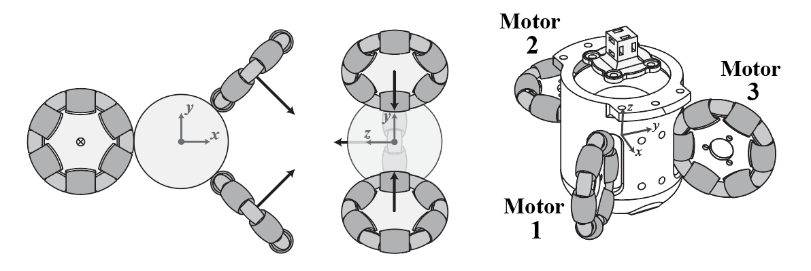
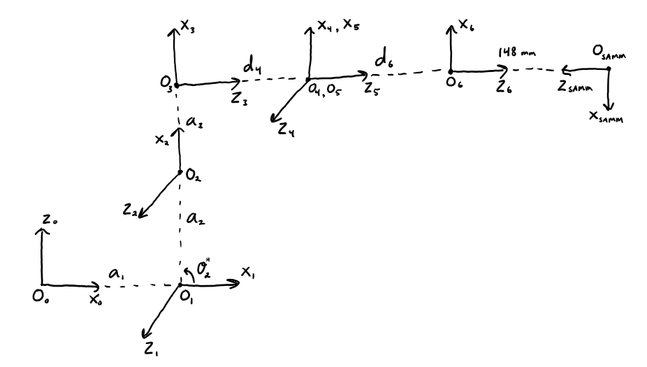

[Home](../Home)
# SAMM - Spherical-Actuator-Magnet Manipulator

**Contents**

[TOC]

>:exclamation: **Serious risk of bodily injury or harm to senstive electronics!** The SAMM contains a **strong permanent magnet**. Always maintain caution when working near the SAMM and avoid bringing magnetically permeable (e.g. ferrous) objects or sensitive electronics into close proximity.

---
## Introduction

The Spherical-Actuator-Magnet Manipulator (SAMM) is a custom end-effector designed to act as a singularity-free 3-DOF spherical-wrist manipulator controlling the orientation of a strong permanent magnet. It consists of a spherical permanent magnet surrounded by three mutually-orthogonal omni wheels and is capable of controlling the magnet dipole direction or continuously rotating the magnet dipole about arbitrary axes.

The SAMM was designed by Sam Wright (yes, he named it after himself) and its theoretical design is presented in the associated IEEE Transactions on Robotics journal publication titled [*The Spherical-Actuator-Magnet Manipulator: A Permanent-Magnet Robotic End-Effector*][tro-paper]. This wiki page contains hardware specifications and implementation details of the SAMM meant to enable its use by members of the lab. The software implementation for controlling the SAMM from a host computer has been implemented in the [Robotics Framework][rob] (see details in the *Software Control from a Host Computer Using the Robotics Framework* section below).

---
## Hardware Specifications and Implementation Details

The implementation of the SAMM in our lab contains a 50.8-mm-diameter (2-inch-diameter), Grade-N42, spherical permanent magnet with a dipole strength of 66.03 A m2. The SAMM can rotate its internal magnet with a maximum angular speed of 3 Hz.

The SAMM base coordinate frame and the number assignments of the wheel-motor combinations are shown in the image below. The base frame origin is located at the center of the internal magnet.

> :information_source: The motor and wheel number assignments here and in the implementation do not match those used in the TRO paper. In that paper, motor/wheel 1 is assigned the number 3 and motor/wheel 3 is assigned 1. However, the SAMM base coordinate frame is the same as that used in the TRO paper.

The center of the mounting-hole pattern at the top of the SAMM is located 148 mm from the SAMM base frame in the +z direction (i.e. the center of the pattern expressed in the SAMM base frame is [0, 0, 148 mm]). This mounting-hole pattern is designed for mounting directly on the [Yaskawa Motoman MH5 6-DOF Robot Arm](Yaskawa_Motoman_MH5_Robot_arm.md) tool flange, however, the pattern is standard and the SAMM may fit on other commercially available robot arms. When using the software implementation supplied by the [Robotics Framework][rob], the SAMM must be mounted to the MH5 robot as indicated in the *Software Control from a Host Computer Using the Robotics Framework* section below.

Download and install ESCON Setup which contains ESCON Studio and the firmware.

[ESCON documentation][maxon-doc]

ESCON Motor 1 Gain = 210
ESCON Motor 2 Gain = 399
ESCON Motor 3 Gain = 180

- The ESCON 36/2 DC Motor Controller LED Meaning
    - Blink green when they are disabled
    - Solid green when enabled
    - Solid or blink red when an error occurs

---
## Software Control from a Host Computer Using the Robotics Framework

The SAMM and MH5SAMMDipoleRobot implementations require the SAMM optional component described below.

extended Kalman filter

Mention the deprecated SAMM-interface repository on Bitbucket.

[tro-paper]: https://www.telerobotics.utah.edu/uploads/Main/Wright_TRO17.pdf
[rob]: https://bitbucket.org/utahtelerobotics/roboticsframework/src/master/
[maxon-doc]: https://bitbucket.org/utahtelerobotics/docs-motors-and-inductive-loads/src/master/