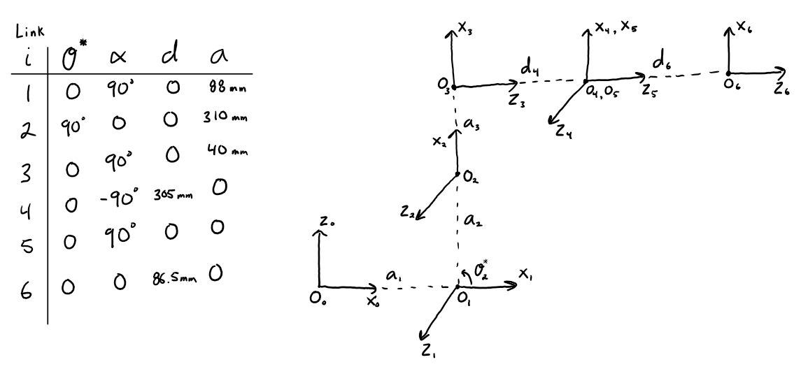
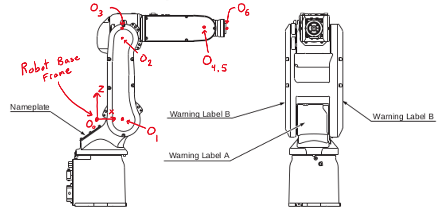
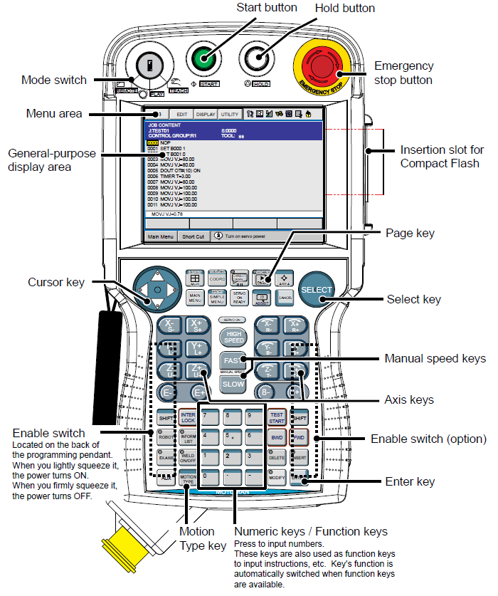

[Home](../Home)
# Yaskawa Motoman MH5 6-DOF Robot Arm

**Contents**

[TOC]

---
## Introduction

The Yaskawa Motoman MH5 6-DOF Robot Arm is our blue industrial robot arm found inside an aluminum safety cage. Specifically, the MH5 refers to the robot manipulator arm itself. The DX100 is the large controller box found underneath the MH5 and is responsible for driving the robot. Connected to the DX100 is a handheld pendant device that is used to manually control the robot. The robot can be software controlled using a computer communicating with the DX100 over Ethernet. A software implementation for controlling the robot from a host computer has been implemented in the [Robotics Framework][rob] (see details in the *Software Control from a Host Computer Using the Robotics Framework* section below).

- [MH5 and DX100 Documentation][docs]
    
    Contains:

    - Documentation from the manufacture
    - A Solidworks CAD model of the MH5 Manipulator
    - Information related to maintenance (receipts, etc.)


---
## The MH5 Robot Arm

###  DH Parameters and Robot Base Coordinate Frame

The MH5 robot arm has 6 revolute joints. Each joint is named with a letter as follows:

- Joint 1 - `S`
- Joint 2 - `L`
- Joint 3 - `U`
- Joint 4 - `R`
- Joint 5 - `B`
- Joint 6 - `T`

Below is the table of DH parameters we use and the corresponding zero-angle diagram. Note that the distances were taken directly from CAD drawings found in the MH5 Manipulator Manual. A diagram indicating the locations of the link frame origins in the context of the actual robot link geometry is also included.

> :information_source: **Reminder: Joint i corresponds to axis z<sub>i-1</sub>**





As indicated in the diagrams above, the robot base coordinate frame is defined as follows. From the point of view of the robot, the x-axis points forward away from the robot, the y-axis points to the left, and the z-axis points upward (these coordinate axes match the ROS standard outlined in [REP 103](https://www.ros.org/reps/rep-0103.html)). A diagram is attached to the peg board in the workspace for quick reference. The base frame origin lies on the joint 1 axis (z<sub>0</sub>) at the same z-height as the Joint 2 axis (z<sub>1</sub>). This results in a base frame that is suspended in the air above the robot's physical base. The DX100 definitely does not internally use these same DH parameters (e.g. three of the joints axis point in the opposite direction from ours), but they may be similar. Regardless, the robot base frame in the diagrams above matches that used internally by the DX100.

### Encoder Battery

>:warning: **The encoder battery in the base of the MH5 robot arm must be replaced approximately every 10 years or the robot's zero angle calibration will be invalidated and the robot will need to be manually recalibrated!**

The encoders measuring joint positions are not absolute encoders. The absolute joint position is known because the encoders are never powered off. There is a battery in the base of the arm that keeps the encoders powered even when the main DX100 power switch is turned off. This battery lasts about **10 years** and a warning will appear on the pendant when the battery level gets low. When this happens, you must contact Yaskawa to purchase a new battery. There are two battery ports such that the new battery can be connected before the old battery is removed. In this way power to the encoders is never lost. More details can be found in the MH5 Manipulator Manual and the DX100 documentation.

The encoder battery was last replaced in February 2019.

---
## Basic Operation

Some basic operation of the robot will be described here. Full details are outlined in the DX100 Operators Manual (accessible through the documentation link above).

### Powering On/Off

The robot is powered on and off using a large switch on the door panel of the DX100. Note that red indicates the power is on and green indicates the power is off. Once the power has been switched on, the DX100 takes some time to boot up. This process can be monitored from the DX100 pendant. The DX100 should be allowed to fully boot up before commanding the robot or powering it off.

### DX100 Programming Pendant

The DX100 Programming Pendant is used to control the robot manually. It is primarily designed to program robot motion in factory settings. However, in our lab it is primarily used to manually jog the robot, manage DX100 Controller settings, and view/investigate error and warning messages. Below is a diagram of the pendant.



A user ID (or password) is required to change the security mode to a higher level which enables access to features and settings. The user IDs have not been changed from the factory presets and can be found in the DX100 Operators Manual. **Do not change the user IDs from the factory presets.** The manual also details each feature and menu allowed in each security mode.

### Manually Jogging the MH5

To jog the robot you must first make sure that the mode switch in the top left corner of the pendant is set to *TEACH*. Then enable power to the joint servos by pressing and holding the enable switch (a black bar on the back of the pendant). Once the servos are powered, you can jog the robot using the axis keys. The axis keys will either jog individual joints or jog the tool flange in task space. The type of jogging is selected using the *COORD* button just under the display on the left. Pressing the *COORD* button changes an icon in the top right of the display. When that icon looks like a robot arm, the axis keys will jog the joints. When the icon looks like a cartesian coordinate frame (without a robot gripper), the axis keys will jog the tool flange in task space. When the DX100 is powered on, it defaults to jogging in joint space. The jogging speed is controlled using the manual speed keys and the current speed setting is indicated at the top of the display next to the coordinate icon. See the DX100 Operators Manual for more details.

### Errors and Warnings

Errors and warnings will appear in the bottom right of the pendant display. Some errors will prevent the robot from moving if they are not cleared. To clear an error or warning message, touch the message in the bottom right of the display and clear it. The message history can be found in the main menu.


---
## Software Control from a Host Computer Using the Robotics Framework

The DX100 runs an Ethernet server that accepts text-based commands to drive the robot. An Ethernet cable has been routed through a hole on the bottom of the DX100 to the Ethernet port inside it. The cable must be connected to the host computer to control the robot. Additionally, the mode switch on the pendant must be set to *REMOTE*. It is common to forget to set the mode switch back to *REMOTE* after manually jogging the robot.

> :warning: **In order to control the robot using a host computer, the mode switch on the pendant must be set to *REMOTE*.**

### IP Network Interface Settings

The Ethernet communication uses the TCP/IP protocol. As such, the network interface must be configured on both the DX100 and the host computer. The network interface settings for the DX100 are configured using the pedant and have already been set up. The IP address and subnet mask configured for the DX100 are:

```
DX100 Network Settings

IPv4 Address:       192.168.255.1
Subnet Mask:        255.255.255.0
```

The network interface (i.e. Ethernet port) on the host computer that is connected to the DX100 should be set to a manual (or static) IPv4 address as follows:

```
Host Computer network Settings

IPv4 Address:   192.168.255.2
Subnet Mask:    255.255.255.0
```

> :information_source: **Note that these network settings result in a subnet with IP addresses in the range `192.168.255.0` to `192.168.255.255`. Any other IP address is considered to be on a different subnet.**

There is no need to configure a DNS server since we are already working with IP addresses and therefore we have no need to resolve domain names into IP addresses. There is also no need to configure a default gateway since both sides of the communication will be on the same subnet. In fact, the host computer's interface can be configured to any IP address within the same subnet as the DX100 as long as it is not the address configured for the DX100.

It is important that all other network interfaces on the host computer (e.g. a connection to the internet) be on a different subnet from that used by the interface connected to the DX100. Otherwise, the host computer won't know which interface to use to send messages to the DX100. If another network interface on the host computer is already using the subnet the DX100 is using, you will need to change one of them in order to avoid network conflicts. If you change the subnet of the DX100, make sure that the subnet address range is entirely contained in the [private address ranges](https://en.wikipedia.org/wiki/Private_network) designated by the IANA. Otherwise you may have trouble accessing certain parts of the internet. More information can be found on this [National Instruments page](https://www.ni.com/en-us/support/documentation/supplemental/11/best-practices-for-using-multiple-network-interfaces--nics--with.html).

### The MH5Robot C++ Class

The Core component of the [Robotics Framework][rob] contains a C++ class that can be used for software control of the MH5 robot. The class is called `MH5Robot` and is found under the `Robots/Motoman` directory of the framework. The `MH5Robot` class is hard-coded to expect that the IP address of the DX100 is configured as stated in the *IP Network Interface Settings* section above. Documentation on the `MH5Robot` class can be obtained by building the framework documentation. Please see the [Robotics Framework][rob] repository for details on its usage and building its documentation. 

The `MH5Robot` class is integrated rather thoroughly with the rest of the Robotics Framework. Therefore, it is not recommended to attempt to use this class separately from the framework (e.g. to copy the source files and use them directly in your own project). Please use the framework as it was intended if you wish to use the `MH5Robot` class.

**Class Implementation Notes**

The connection to the DX100 Ethernet server will time out automatically after 30 seconds of activity. The `MH5Robot` class will automatically detect this and reestablish the connection. You will notice infrequent warning messages on the console output when this occurs. These messages are normal and can be ignored.

The DX100 Ethernet server processes requests at an unfortunately slow rate. This fact prevents the host computer from obtaining or commanding the robot state at high frequencies. Therefore, the implementation of the `MH5Robot` class maintains a sort of "digital twin" simulation that estimates the motion of the robot in between commanded poses. When a request for the robot pose is made to the  `MH5Robot` class, it returns this estimate instead of directly asking the DX100. This enables tracking the robot state at much higher rates. Unfortunately, there is no way to artificially increase the rate at which the robot can be commanded to new poses. You may use issue new commands via the `MH5Robot` class as fast as you like, however, the class implementation sends commands at a fixed internal rate and it uses the most recently received command.

[rob]: https://bitbucket.org/utahtelerobotics/roboticsframework/src/master/
[docs]: https://bitbucket.org/utahtelerobotics/docs-yaskawa-motoman-6dof-arm/src/master/