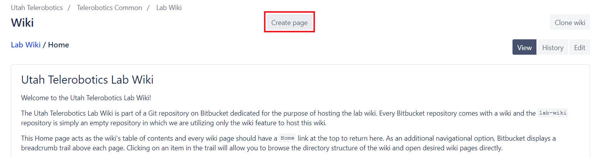
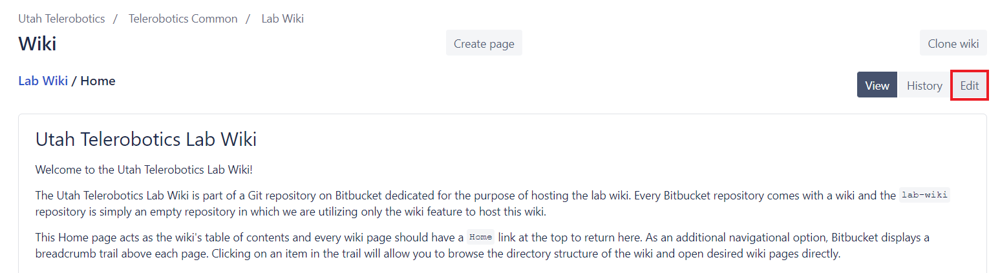

[Home](../Home)
# How to Edit this Wiki

This page will help you learn how to edit this wiki to add your own contributions. The [Bitbucket documentation][1] also has more information about using a wiki.

**Contents**

[TOC]

## Introduction

Wiki pages are nothing more than plain text files with the `.md` extension. The `.md` extension indicates that the file is a Markdown file which contains [Markdown syntax](Markdown.md). Markdown syntax allows you to specify text formatting, links to other pages, and do other useful things. **It can also be learned in just an hour or two.** Once written, a Markdown file is then *rendered* (usually by a website like Bitbucket or GitHub) to display the formatted page. If you are reading this page on Bitbucket, you are seeing the rendered page.

There are two ways to edit this wiki:

1. Edit online using a web browser
    - Only good for **quick and small edits**
2. Edit locally on your computer using a text editor and Git
    - Good for **edits of any kind**, especially larger edits
    - This is the only option available for adding images and PDFs or changing the directory structure of the wiki itself 

---
## Edit Using A Web Browser - Quick and Small Edits

>:exclamation: **WARNING:** If another person edits and saves a change to a page you are currently editing, you will be prevented from saving your changes and must start again from scratch.

When viewing this wiki on the Bitbucket website there are controls to create and edit pages online from within your browser directly. This method should only be used for quick and small edits. If another person edits and saves a change to a page you are currently editing, you will be prevented from saving your changes and must start again from scratch.

To **create a new page**:

1. Click on "Create page" at the top of any wiki page

2. Give your page a title in the "Title" box
    - Do not use spaces in the title. Use underscores for spaces.
    - Do not include `.md` or any other file extension in the title. The extension is implied by the file type selected in the top right corner of the content editor.
    - The title is in fact a file path relative to the root directory of the wiki. To place the page in a particular directory of the wiki, prepend the title with the path to that directory. For example, the title `dir1/dir2/New_Page` will create a `New_Page` file in a `dir2` directory inside a `dir1` directory which is in the root directory of the wiki.
3. Add some text in the content editor
    - Leave the file type as Markdown
    - The content editor has useful buttons to add Markdown syntax or preview the rendered page
4. Add a commit message
    - The message should be something like "Created New_Page.md". Creating a page from a browser will create a new commit on the wiki's Git repository so please don't leave this blank. If you do, Bitbucket will use a generic and unhelpful default message.
5. Click "Save" to commit the change

To **edit a page**:

1. Click on "Edit" in the top right corner of the page you wish to edit

2. You may change the title in the "Title" box
3. You may change the content in the content editor
4. Add a commit message
    - Describe the change that was made
    - Prepend the message with the name of the file and a colon (e.g. `Home.md: Example commit message`)
5. Click "Save" to commit the change

The "History" button will show a list of commits that modified the file in some way. The "Delete" button will delete the page from the wiki (the Home page cannot be deleted).

---
## Edit Using A Text Editor and Git - All Edits

>**IMPORTANT:** Understanding [how to use Git](Git.md) is a prerequisite for this method of editing the wiki!

The wiki itself is actually a Git repository in its own right that exists alongside the `lab-wiki` repository currently hosting the wiki. This means you can clone it, edit it locally/offline, add images or any other file type, and push it back to Bitbucket. Pushed changes will be live on the web immediately.

The URL of the wiki is the same as the URL for the `lab-wiki` repository but has `/wiki` appended to it (to specify that we want the wiki itself and not the empty repository hosting the wiki). The wiki can be cloned using:

SSH
```
$ git clone git@bitbucket.org:mmrobotics/lab-wiki.git/wiki
```
HTTPS
```
$ git clone https://bitbucket.org/mmrobotics/lab-wiki.git/wiki
```

Since the Markdown files that makeup the wiki repository just contain plain text, they are easily created and modified with the text editor of your choice. **[Visual Studio Code](../useful_resources/Visual_Studio_Code.md) is highly recommended as a preferred text editor** because it has built-in support for Markdown syntax highlighting and IntelliSense out-of-the-box and has a Markdown preview window to see how edits affect the rendered page in real-time. There are extensions to enhance the preview window to see what the page will look like on [Bitbucket][2] or [GitHub][3] as well as enable it to [render emojis][4]. There is also a handy [spell checker extension][5]. All of these extensions can be installed and enabled in seconds from within VS Code with a single click.

### Adding Non-Markdown Files

When you edit the wiki locally as a Git repository, you can add non-Markdown files and reference them from Markdown files using links. Most file types do not belong in the wiki, but a few are perfect for it.

#### Images

Images can be embedded into rendered Markdown files. If the image you are embedding cannot be accessed using a URL over the internet, you must put the image into a directory within the wiki itself. Be conscious of good file/directory organization and group images together into a dedicated directory if that makes sense. The path to the image relative to the Markdown file referencing it can then be used.

#### PDFs

Similar to images, PDFs can be added to the wiki file structure and referenced from Markdown files using the standard Markdown link syntax. On Bitbucket, the link will pull up a new tab to display the PDF.

## Wiki Editing Best Practices

- Do not use spaces in file names. Use underscores instead of spaces to separate words.
- Prepend commit messages with the file name that was edited followed by a colon (e.g. `Home.md: Example commit message`)
- Use directories to keep files and images organized.
- Add a table of contents at the top of larger pages using `[TOC]` (see the source of this page for an example).

[1]: https://confluence.atlassian.com/x/FA4zDQ
[2]: https://marketplace.visualstudio.com/items?itemName=hbrok.markdown-preview-bitbucket
[3]: https://marketplace.visualstudio.com/items?itemName=bierner.markdown-preview-github-styles
[4]: https://marketplace.visualstudio.com/items?itemName=bierner.markdown-emoji
[5]: https://marketplace.visualstudio.com/items?itemName=streetsidesoftware.code-spell-checker