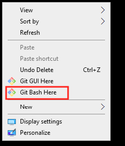

[Home](../Home)
# Git

**Contents**

[TOC]

---
## Introduction

Git is a distributed Version Control System (DVCS) used primarily to keep track of changes in source code. Learning how to use Git is required by everyone in the lab (even if they never write any code) because this wiki is [managed as a Git repository of Markdown files](Editing_the_Wiki.md).

Those who write code (including MATLAB code) for research projects during their time in the lab must manage their code in Git repositories. There are several advantages when using Git.

#### Git will help you keep your code clean and organized

Git allows you to store, recall, and browse previous versions of your code instantly. This enables cleaner and more organized code writing practices leading to code that is easier to understand by those reading it later on, including yourself. For example, you do not need to keep commented blocks of code just because you think you might need them one day. Instead, you can feel secure deleting those old unused lines of code knowing that if you did happen to need them, they can be recalled in the future. As another example, let's say you want to keep a copy of your code corresponding to a particular journal publication, but you want to be able to continue changing your code for future work. You don't need to keep a separate copy of you code (e.g. using a ZIP file; unfortunately, the lab group drive is a disorganized mess filled with versions of code kept in ZIP files) for this purpose because a Git repository contains your entire project history! Instead, you can tag a version (called a commit) with a descriptive name and easily switch between that version and the version you're currently working on.

#### Git repositories can be hosted in the cloud

You can push your local changes to a cloud-based Git repository and mitigate the chances of lost work due to data loss on your physical computer. A cloud-based Git repository also allows you to easily share your work and collaborate with other students because they can clone the repository to their computer, make changes, and push those changes too, provided you've given them permissions to do so. Even if you are not collaborating with another student, hosting the repository on the cloud allows you to push/pull work to/from different computers (e.g., a lab computer and a home computer) seamlessly. Common Git hosting services include GitHub, Bitbucket, and GitLab.

#### Our lab has a Bitbucket workspace

For these reasons, our lab has a workspace on Bitbucket to host Git repositories containing research project code. Repositories created in this workspace belong to the lab and can be modified by members of the workspace. Once you learn Git, please see the lab [Git Standards](../Git_Standards.md) for lab standards relating to the use of Git repositories and Bitbucket.

---
## Using Git

Git is a program that is invoked via the command-line command `git`. As such the primary way many people use Git is on the command line. However, there exist a myriad of graphical user interfaces (GUIs) that invoke the `git` command under the hood for you and therefore simplify the use of Git for people more comfortable with graphical user interfaces. Don't feel obligated to use the command line to use Git, however, doing so will help enrich your understanding of Git.

### Using Git on the Command Line

#### Git Bash on Windows

Git Bash allows you to use Git in a Bash shell for Windows (i.e. on the command line like you would on Linux). The easiest way to install and use Git Bash on Windows is to install it from the [Git for Windows](https://gitforwindows.org/) project. Installing Git Bash can be a bit confusing so see [Installing Git Bash on Windows](Git_Bash_Windows_Installation.md) for help.

Once Git Bash is installed, you can pull up a Git Bash terminal in any directory by using the **Git Bash Here** option in the right-click context menu, as shown below.



#### Git on Linux

Installing Git on Linux is easy. Simply install it with the APT package manager:

```
sudo apt install git
```

Git is then used in the terminal simply by invoking it with the `git` command.

### Using Git with Graphical User Interfaces (GUIs)

Git keeps a list of popular [Git GUI clients](https://git-scm.com/downloads/guis).

Of particular interest in this list are:

- GitKraken (Linux, Mac, Windows)
- SourceTree (Mac, Windows)

It is also commonplace for code writing software (IDE's) such as MATLAB, Visual Studio Code, and Qt Creator to integrate their own Git GUI client interfaces into the code writing software itself so you don't need a separate program to use Git. This may still require installing Git separately.

---
## Learning Git

### What You Need to Know

Given there are many ways to use Git either through the command line or the wide variety of GUIs, it makes sense to list general Git concepts with which you should make yourself familiar. You should understand the following concepts and know how to interact with them through your chosen method of using Git.

- Configuration variables
    - Know how to set them and how to see what values are active in a given context.
    - Know the difference between the three configuration variable context levels **local** (i.e. repository), **global** (i.e. user), and **system** (i.e. computer). Note: It is uncommon to use the **system** context level.
    - Know where these configuration variable values are stored (i.e. know what `.gitconfig` files are and where to find them).
    - Know the function of these configuration variables at a minimum:
        - **user.name**
        - **user.email**
        - **core.editor**
- Git Commit Graph
    - Understand the structure of the commit history in a git repository (i.e. the commit graph).
    - Understand the concept of a commit ID hash.
    - Understand commit references (e.g, branches, HEAD, tags).
        - Understand the special HEAD reference.
        - Understand tags.
    - Understand how to see the log of the commits in the repository.
- Committing
    - Understand the stage and the working tree.
    - Understand how to see the status of the repository and how to view current changes in the working tree.
    - Understand how to add/remove modified files to/from the stage.
    - Understand how to commit staged changes.
    - Understand what makes a good commit message.
    - Understand the `.gitignore` file and the right way to use it.
- Branches
    - Understand how to create branches.
    - Understand how to delete branches.
    - Understand how to switch between branches.
    - Understand what branches are from the perspective of the commit graph.
- Merging
    - Understand how to merge a branch into another branch.
    - Understand how to recognize and deal with merge conflicts.
- Remotes
    - Understand how to clone a repository.
    - Understand HTTPS and [SSH protocols](Using_Git_with_SSH.md) for interacting with remote repositories.
    - Understand how to set up a local branch to track a branch on a remote repository.
    - Understand how remote branches work, especially from the perspective of the local repository.
    - Understand how to push/pull changes to/from the remote repository.

Given that the repositories we have in our lab are private repositories hosted on Bitbucket and given the fact that hosting services like Bitbucket and Github no longer allow simple username and password authentication over the HTTPS protocol, it is important to understand how to use Git with the SSH protocol. See [Using Git with the SSH Protocol](Using_Git_with_SSH.md) for more information.


### Learning Resources

Here is a list of resources that should help you learn the concepts from the previous section and get you up and running quickly.

- [Version Control with Git](https://www.coursera.org/learn/version-control-with-git) (Coursera course)
    - Free online Coursera course offered by Atlassian (the company behind Bitbucket). Probably the best way to learn Git.
- [Introduction to Git and GitHub](https://www.coursera.org/learn/introduction-git-github?specialization=google-it-automation) (Coursera course)
    - Free online Coursera course offered by Google. Also a great way to learn Git, but does not offer a GUI-based learning track. This course is particularly useful for understanding remote repositories.
- [ProGit Textbook](Pro_Git.pdf)
    - Considered the official textbook on Git. It's useful, but not necessarily the best/fastest method of learning Git.
- [Git Cheatsheet](Atlassian_Git_Cheatsheet.pdf)
    - A cheatsheet for command-line users of Git.
