[Home](../Home)
# Installing Git Bash on Windows

The easiest way to install and use Git Bash on Windows is to install it from the [Git for Windows](https://gitforwindows.org/) project. The installation of Git Bash has several options that a novice user may not know the meaning of yet. Below are instructions for installing Git Bash taken from [here](https://adamtheautomator.com/git-bash/), and explains a bit about some of the options:

1. Launch the installer you downloaded and click **Next** through the steps until you get to the **Select Components** screen.
2. Now, check the boxes of additional components you want to include in the installation. Leave the ones selected by default, as shown below, and click **Next**.

    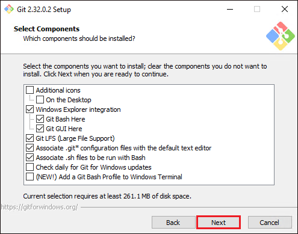

3. Leave the default for creating a shortcut in the start menu folder, and click **Next**.

    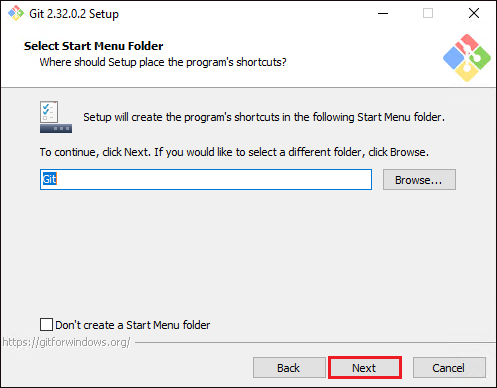

4. (*Note: For this step our lab recommends using Visual Studio Code as Git's default editor instead of Notepad, but you may use whatever default editor that you prefer.*) Select **Use Notepad as Git’s default editor** from the drop-down list as a default editor to use with Git, and click **Next**. Now Git files like **~./gitconfig** will open in Notepad by default.

    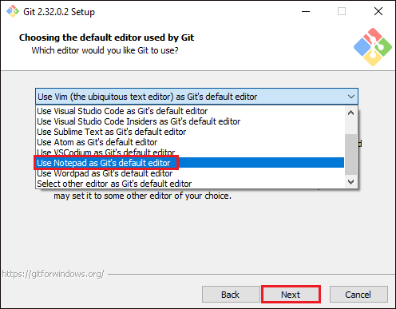

5. Select the **Let Git Decide** option as the default branch name (**currently master**) for Git to use. When you initialize a Git repository, Git will use this branch name by default.
6. Now, select **Git from the command line and also from 3rd-party software** option so that Git command can be executed from different tools. Some of those tools are Command Prompt, PowerShell or any other 3rd party software tools, along with the Git Bash console.

    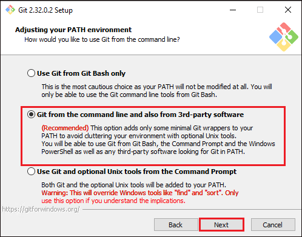

7. Select the **Use the OpenSSL library** option to let Git validate certificates with OpenSSL, and click **Next**. OpenSSL is a cryptographic library that contains open-source implementation of SSL and TLS protocols.

    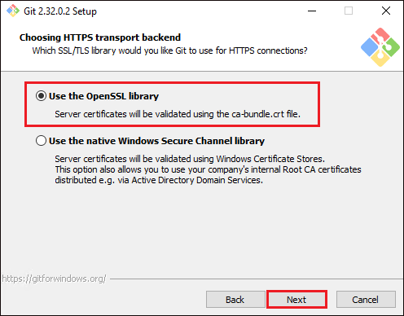

8. Leave the default **Checkout Windows-style, commit Unix-style line endings** option selected, and click **Next**. If you configure “Windows-style” line ending conversions, when you hit return on your keyboard after executing a Git command, Git will insert an invisible character called a line ending. When different contributors make changes from different operating systems, Git might produce unexpected results.

    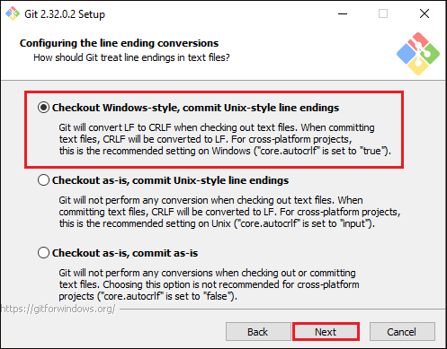

9. Select the **Use Mintty (the default terminal of MSYS2)** option as the default terminal emulator to run commands, and click **Next**. Mintty is the default terminal of MSYS2. MSYS2 is a collection of tools and libraries that provides a Unix-like environment for software distribution and a building platform for Windows.

    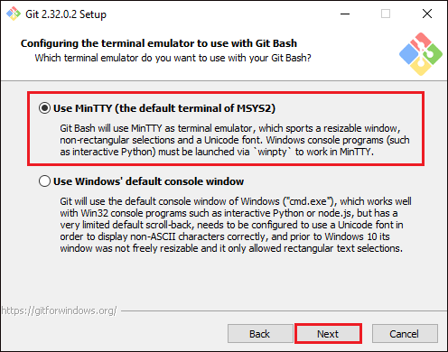

10. Select the **Default (fast-forward or merge)** option below as `git pull` command’s default behavior. The `git pull` command is the shorthand for `git fetch` and `git merge`, which fetches and incorporates changes from a remote repository into the current branch. Perhaps you want to merge a new branch to the master. If so, Git would directly merge using fast-forward without going through `git fetch` and `git merge` commands. The merge is only possible if there are no commits on master from when you’ve created the new branch.

    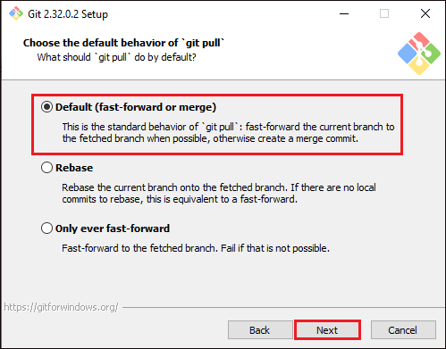

11. Select the **Git Credential Manager Core** as the default Git credential helper, and click **Next**. Git credential helpers are external programs that Git can prompt for input data, like usernames and passwords. These input data can be stored in memory for a limited time or stored on the disk. Git Credential Manager Core is based on the .NET framework and will provide multi-factor HTTPS authentication with Git.

    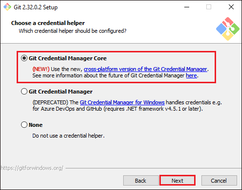

12. Leave the extra features on default, as shown below, and click **Next**. The **Enable file system caching** option is checked to provide quick results when executing Git commands.

    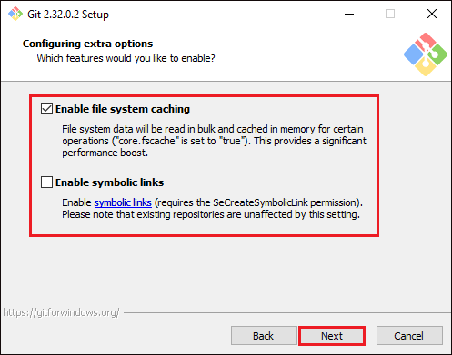

13. Ensure to leave both options below at default (**pseudo console** and **built-in file system monitor**) as they are still in an experimental stage, and click **Install**.

    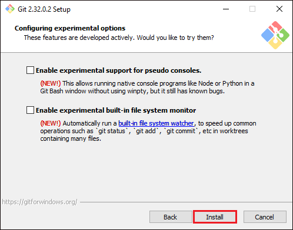

14. Complete the installation and close the installation wizard by clicking on **Finish**.

    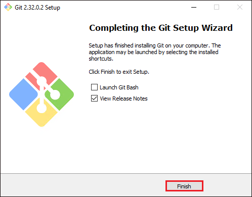