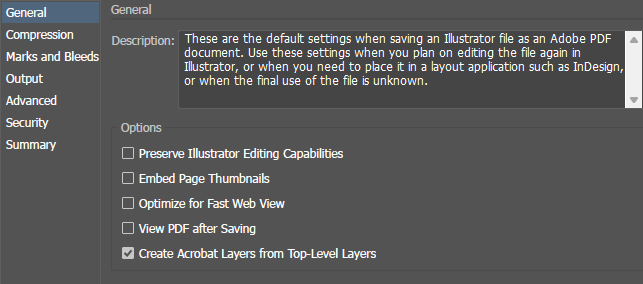
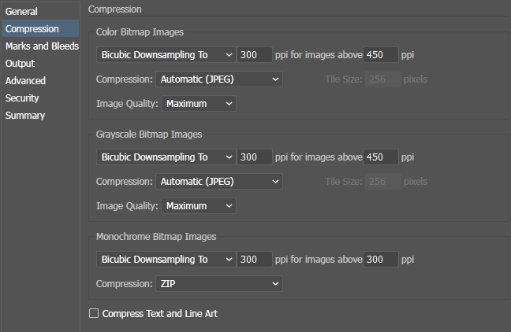
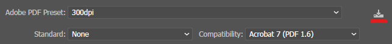

[Home](../Home)
# Adobe Illustrator

This page contains information related to using Adobe Illustrator.

[TOC]

## Learning Adobe Illustrator

- [Illustrator 2022 MasterClass](https://www.udemy.com/course/illustrator-cc-masterclass/) on Udemy

## Efficiently Exporting to PDF

Use the following export settings when you want to export a project to PDF and keep the resulting file size small while maintaining visual quality sufficient for journal publications.

1. To begin the export to PDF, use the *File > Save a Copy...* option and set the file type to PDF.
2. Give the file a name and click *Save*.
3. Use the following **General** and **Compression** settings in the *Save Adobe PDF* dialog box that appears. Leave all other settings as default.

    
    
    

4. Once the settings have been configured, you can save them as an *Adobe PDF Preset* using the button in the image below (indicated with a red underline) to easily use them every time you need to export to PDF. It is recommended to name the preset something descriptive like `300dpi` or similar.

    

5. Click *Save PDF*. You may get a warning that saving a document with *Preserve Illustrator Editing Capabilities* unchecked may disable some editing features when the document is read back into Illustrator. This is desirable as it prevents people from accessing undesirable content in work that is made public (e.g. a journal paper).